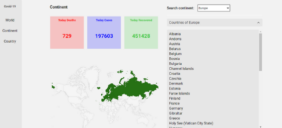
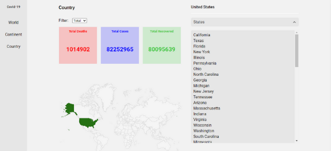

## Covid-19

### Sobre

<p> Esse projeto foi desenvolvido para testar a <a href='https://disease.sh/'> API disease.sh </a> de informações sobre o coronavírus e para <strong> fins de estudos. </strong> </p>

##

### Páginas

 #### Mundo

* Você vai ter acesso as informações de mortes, casos e recuperados do coronavírus no mundo;
* Com gráficos para mostrar os dados dos últimos dias.


#### Continente

* Você vai ter acesso as informações de mortes, casos e recuperados do coronavírus no continente;
* Poderá ver os países que pertence a esse continente.



#### País

* Você vai ter acesso as informações de mortes, casos e recuperados do coronavírus no país;
* Poderá ver os estados que pertence a esse país;
* Filtrar as informações(no dia ou total).



##

### Pré-requisitos

<p> Antes de começar, você precisa ter instalado em sua máquina a seguinte ferramenta <a href='https://git-scm.com/downloads'> Git </a>. Além disso, é preciso ter um bom editor para trabalhar com o código como o <a href='https://code.visualstudio.com/'> VSCode</a>. </p>

##

#### Rodando o Front-end
 ``` bash
  # Clone esse repositório
  $ git clone <https://github.com/pedrosouz6/covid-19>
  
  # Acesse a pasta do projeto no terminal/cmd
  $ cd NomeDaPasta
  
  # Instale as dependências
  $ npm install
  
  # Execute a aplicação em modo de desenvolvimento
  $ npm start
  
  # o servidor iniciará na porta:3000 - acesse <http://localhost:3000>
```

##

### Tecnologias usadas

<div style='display: flex;'>
  
  
</div>

## 

<p> Desenvolvido por Pedro Souza </p>
